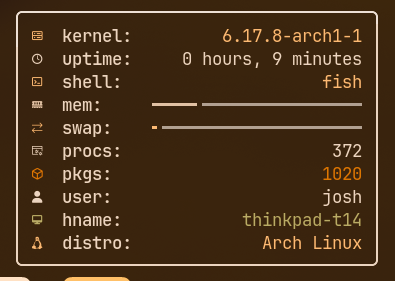
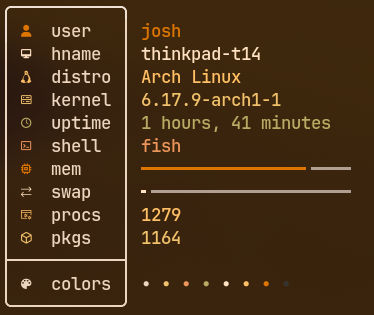
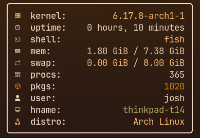
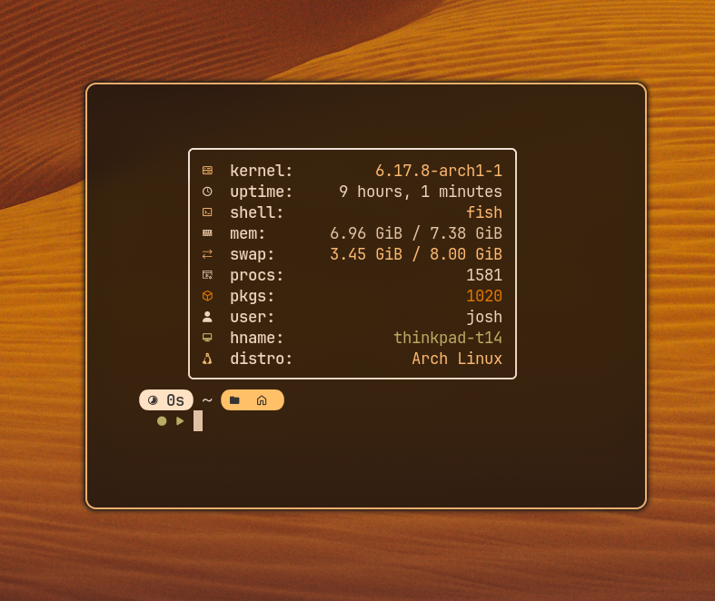

# Simple C Fetch

### Normal:

### Alt:


A very simple single file C fetch that I put together in a rush.

Testing with `hyperfine -N`: nitch had a mean of 1.8ms, scfetch 1.0ms and fastfetch 7.7ms.

This has only been tested on Arch Linux but everything should work except for the package count. To make it work
you will need to edit the _PACKAGE_PATH marco in the file to the appropriate path.

### Usage:
```sh
scfetch [paddingLeft] [boxWidth]
```
Minimum width with bars is 31 without is 30.
Maximum width with bars is 389 without is 456.

(Pipe into echo for very slightly better performance at least with fish shell)

### Default:
```sh
scfetch 0 35
```

### Build with gcc:
(Remove the macros for the elements you dont want, remove the _BARS macro if you want ram and swap to display as text)

Add the _ALT macro if you want the alternate version.

There is also a _PROFILING macro that times all the modules.

You can also change the colours by changing the colour macros inside the file using [`ansi escapes`](https://gist.github.com/fnky/458719343aabd01cfb17a3a4f7296797#color-codes).

```sh
gcc -D_KERNEL\
    -D_UPTIME\
    -D_SHELL\
    -D_RAM\
    -D_SWAP\
    -D_PROCESSES\
    -D_PACKAGES\
    -D_USER\
    -D_HOSTNAME\
    -D_DISTRO\
    -D_BARS\
    -D_COLOURS\
    main.c -o scfetch
```




