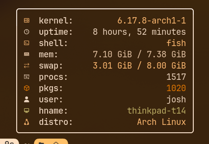

# Simple C Fetch

A very simple single file C fetch that I put together in a rush because fastfetch was too slow.

### Usage:
```sh
scfetch [paddingLeft] [boxWidth]
```

### Default:
```sh
scfetch 0 35
```

(Pipe into echo for very slightly better performance)

### Build with gcc(Remove the macros for the elements you dont want):

```sh
gcc -D_KERNEL -D_UPTIME -D_SHELL -D_RAM -D_SWAP -D_PROCESSES -D_PACKAGES -D_USER -D_HOSTNAME -D_DISTRO main.c -o scfetch
```




